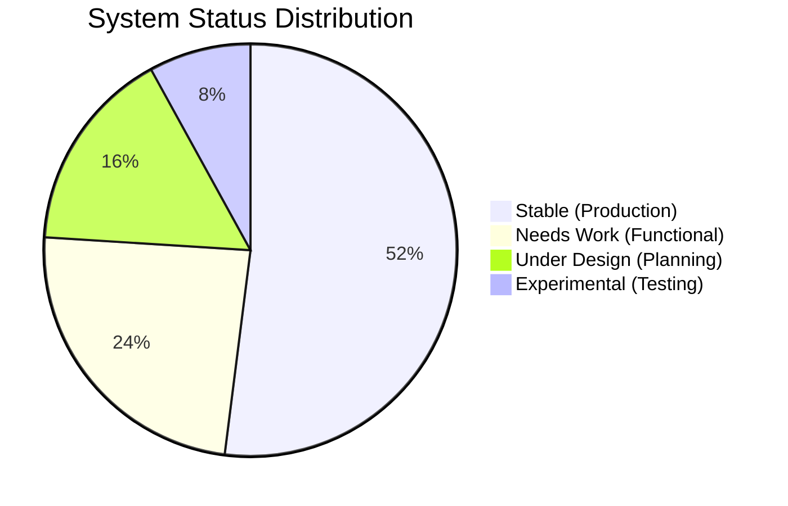
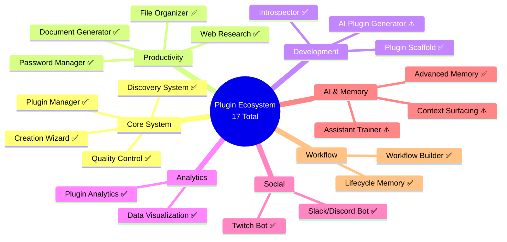
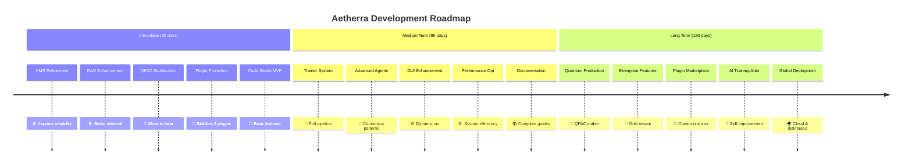

# 🧠 Aetherra Master Mind Map

```mermaid
graph TB
    %% Central Node
    AOS[🌌 AETHERRA OS<br/>AI Operating System]

    %% Top Level Systems
    AOS --> UI[🖥️ USER INTERFACES]
    AOS --> HUB[🌐 AETHERRA HUB]
    AOS --> KERNEL[⚙️ KERNEL SYSTEM]
    AOS --> ENGINE[🧠 AI ENGINE]
    AOS --> AGENTS[🤖 AGENT SYSTEM]
    AOS --> MEMORY[💾 MEMORY SYSTEM]
    AOS --> PLUGINS[🔌 PLUGIN ECOSYSTEM]
    AOS --> SECURITY[🔐 SECURITY SYSTEM]
    AOS --> SCRIPTS[📜 AETHER SCRIPTS]

    %% User Interfaces
    UI --> GUI[Hybrid GUI<br/>✅ PySide6 + Web]
    UI --> WEB[Web Dashboard<br/>✅ HTML Panels]
    UI --> CLI[CLI Interface<br/>✅ Terminal]

    %% Hub System
    HUB --> APIs[REST & SSE APIs<br/>✅ Port 3001]
    APIs --> CHAT_API[Chat APIs<br/>/api/ai/*]
    APIs --> AGENT_API[Agent APIs<br/>/api/agents/*]
    APIs --> MEM_API[Memory APIs<br/>/api/memory/*]
    APIs --> KERN_API[Kernel APIs<br/>/api/kernel/*]

    %% Kernel System
    KERNEL --> KLOOP[Kernel Loop<br/>✅ Priority Queues]
    KERNEL --> SREG[Service Registry<br/>✅ Lifecycle Mgmt]
    KERNEL --> KEB[Event Bus<br/>✅ Pub/Sub]
    KERNEL --> KLM[Module Manager<br/>✅ Hot Reload]
    KERNEL --> HMR[HMR System<br/>⚙️ Needs Work]
    KERNEL --> NIGHT[Night Cycle<br/>✅ Maintenance]

    %% AI Engine
    ENGINE --> CONV[Conversation Engine<br/>✅ Chat Processing]
    ENGINE --> REASON[Reasoning System<br/>✅ Logic & Inference]
    ENGINE --> RAG[RAG Pipeline<br/>⚙️ Being Enhanced]
    ENGINE --> TASKS[Task Execution<br/>✅ Delegation]
    ENGINE --> IMPROVE[Self-Improvement<br/>✅ Auto Optimization]

    %% Agent System
    AGENTS --> ORCH[Agent Orchestrator<br/>✅ Multi-Agent Coord]
    AGENTS --> TMGMT[Task Management<br/>✅ Lifecycle & Routing]
    AGENTS --> AREG[Agent Registry<br/>✅ Discovery & Caps]
    AGENTS --> EVAL[Evaluation Harness<br/>⚙️ Performance Testing]
    AGENTS --> PATTERNS[Pipeline Patterns<br/>✅ Sequential/Parallel]

    %% Memory System
    MEMORY --> CORE_MEM[Core Memory<br/>✅ SQLite Storage]
    MEMORY --> ADV_MEM[Advanced Memory<br/>⚙️ Fractal/QFAC]
    MEMORY --> QUANTUM[Quantum Memory<br/>🧩 QFAC Experimental]
    MEMORY --> NARR[Narratives<br/>✅ Daily Summaries]
    MEMORY --> HEALTH[Health Monitoring<br/>✅ Coherence Check]

    %% Plugin Ecosystem
    PLUGINS --> PCORE[Core Plugins<br/>✅ 13 Stable]
    PLUGINS --> PGUI[GUI Plugins<br/>✅ 10 Available]
    PLUGINS --> PMGMT[Plugin Management<br/>✅ Lifecycle Control]
    PLUGINS --> PQUAL[Quality Control<br/>✅ Validation]

    %% Key Plugins Detail
    PGUI --> DOC[Document Generator<br/>✅ Templates & PDF]
    PGUI --> VIZ[Data Visualization<br/>✅ Charts & Analytics]
    PGUI --> WEB_RES[Web Research<br/>✅ Fact-checking]
    PGUI --> WORKFLOW[Workflow Builder<br/>✅ Visual Design]

    %% Security System
    SECURITY --> SIGNING[Script Signing<br/>✅ HMAC + Ed25519]
    SECURITY --> SANDBOX[Sandbox System<br/>✅ AST Restriction]
    SECURITY --> CAPS[Capability Gates<br/>✅ Permissions]
    SECURITY --> SECRETS[Secrets Management<br/>✅ Encrypted Storage]

    %% Aether Scripts
    SCRIPTS --> COMPILER[Compiler<br/>✅ Language Processing]
    SCRIPTS --> EXEC[Execution Engine<br/>✅ Workflow Runner]
    SCRIPTS --> VERIFY[Verification<br/>✅ Signature Check]
    SCRIPTS --> WORKFLOWS[Sample Workflows<br/>✅ 3 Demos]

    %% Status Color Coding
    classDef stable fill:#90EE90,stroke:#006400,stroke-width:2px
    classDef needsWork fill:#FFD700,stroke:#B8860B,stroke-width:2px
    classDef underDesign fill:#87CEEB,stroke:#4682B4,stroke-width:2px
    classDef experimental fill:#DDA0DD,stroke:#8B008B,stroke-width:2px

    %% Apply Classes
    class GUI,WEB,CLI,APIs,KLOOP,SREG,KEB,KLM,NIGHT stable
    class CONV,REASON,TASKS,IMPROVE,ORCH,TMGMT,AREG,PATTERNS stable
    class CORE_MEM,NARR,HEALTH,PCORE,PGUI,PMGMT,PQUAL stable
    class DOC,VIZ,WEB_RES,WORKFLOW,SIGNING,SANDBOX,CAPS,SECRETS stable
    class COMPILER,EXEC,VERIFY,WORKFLOWS stable

    class HMR,RAG,EVAL,ADV_MEM needsWork

    class QUANTUM underDesign
```

## 🎯 System Dependency Flow

```mermaid
graph LR
    %% Boot Sequence Flow
    START([System Boot]) --> SR[Service Registry<br/>✅ Foundation]
    SR --> SEC[Security System<br/>✅ Protection]
    SEC --> MEM[Memory System<br/>✅ Data Layer]
    MEM --> PM[Plugin Manager<br/>✅ Capabilities]
    PM --> ENG[AI Engine<br/>✅ Intelligence]
    ENG --> AG[Agent System<br/>✅ Orchestration]
    AG --> HUB[Hub System<br/>✅ APIs]
    HUB --> KERN[Kernel Loop<br/>✅ Runtime]
    KERN --> GUI[GUI System<br/>✅ Interface]
    GUI --> READY([🚀 System Online])

    %% Status indicators
    classDef stable fill:#90EE90,stroke:#006400,stroke-width:2px
    class SR,SEC,MEM,PM,ENG,AG,HUB,KERN,GUI stable
```

## 📊 System Health Overview

```mermaid
pie title System Status Distribution
    "Stable (Production)" : 13
    "Needs Work (Functional)" : 6
    "Under Design (Planning)" : 4
    "Experimental (Testing)" : 2
```

## 🔌 Plugin Ecosystem Map

```mermaid
mindmap
  root((Plugin Ecosystem<br/>17 Total))
    Core System
      Plugin Manager ✅
      Discovery System ✅
      Creation Wizard ✅
      Quality Control ✅

    Productivity
      Document Generator ✅
      File Organizer ✅
      Password Manager ✅
      Web Research ✅

    Development
      AI Plugin Generator ⚠️
      Plugin Scaffold ✅
      Introspector ✅

    Analytics
      Data Visualization ✅
      Plugin Analytics ✅

    Social
      Slack/Discord Bot ✅
      Twitch Bot ✅

    AI & Memory
      Advanced Memory ✅
      Assistant Trainer ⚠️
      Context Surfacing ⚠️

    Workflow
      Workflow Builder ✅
      Lifecycle Memory ✅
```

## 🚀 Development Roadmap Timeline

```mermaid
timeline
    title Aetherra Development Roadmap

    section Immediate (30 days)
        HMR Refinement     : ⚙️ Improve reliability
        RAG Enhancement    : ⚙️ Better retrieval
        QFAC Stabilization : 🧩 Move to beta
        Plugin Promotion   : 🔄 Stabilize 3 plugins
        Code Studio MVP    : 🧩 Basic features

    section Medium Term (90 days)
        Trainer System     : 🧩 Full pipeline
        Advanced Agents    : 🔄 Consensus patterns
        GUI Enhancement    : ⚙️ Dynamic viz
        Performance Opt    : ⚙️ System efficiency
        Documentation      : 📚 Complete guides

    section Long Term (180 days)
        Quantum Production : 🧩 QFAC stable
        Enterprise Features: 🧩 Multi-tenant
        Plugin Marketplace : 🧩 Community eco
        AI Training Auto   : 🧩 Self-improvement
        Global Deployment  : 🌍 Cloud & distributed
```
