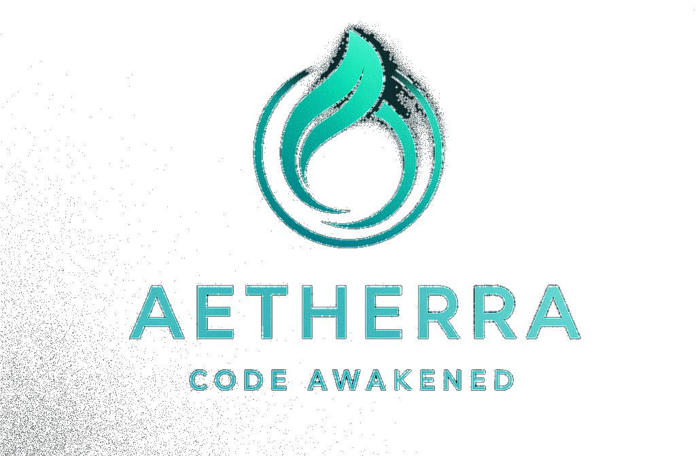

<!--
SPDX-License-Identifier: GPL-3.0-or-later
SPDX-FileCopyrightText: 2025 Aetherra & Lyrixa Contributors
-->

<p align="center">
  
</p>

<h1 align="center">🌟 Aetherra — Code Awakened</h1>

<p align="center">
  <strong>The Next-Generation AI-Native Development Environment</strong><br>
  Where intelligence meets creativity, and code comes alive.
</p>

<p align="center">
  
  
  
</p>

<p align="center">
  
  
  
</p>

---

## 🚀 **What is Aetherra?**

**Aetherra** is a revolutionary AI-native development environment that transforms how you create, think, and build software. With **Lyrixa** as your intelligent companion, Aetherra bridges the gap between human creativity and artificial intelligence.

> Note: The Discord bot is an internal Aetherra Labs tool and is excluded from public releases. Community builds do not include or require Discord integration.

### **🚀 Latest Enhancement: Major System Overhaul (August 2025)**

**MASSIVE DEPLOYMENT COMPLETED**: Aetherra has undergone the largest system integration in its history:

#### **🤖 Discord Bot Integration (Internal-only)**
- This subsystem is for Aetherra Labs internal use and is not shipped in public releases.
- **1,424-line Discord Bot**: Full-featured Lyrixa bot with AI integration
- **Multi-Server FastAPI**: Dual server architecture (ports 8008, 8686)
- **GitHub Monitoring**: Automated repository tracking and notifications
- **Auto-Moderation**: Intelligent content filtering and community management
- **Comprehensive Commands**: `/asklyrixa`, `/reflect`, `/goals`, `/plugins` and more
- **AI Conversation**: Direct Discord integration with Aetherra.lyrixa.assistant
- **Fallback System**: Simple_lyrixa backup for reliability

#### **🎨 Phase 3-6 GUI Evolution (NEW!)**
- **Phase 3 Auto-Generator**: Automated GUI component generation
- **Phase 4 Cognitive UI**: Intelligent interface adaptation
- **Phase 5 Plugin UI**: Advanced plugin visualization system
- **Phase 6 Personality**: Complete personality management interface
- **Web Panel Integration**: Modern HTML interfaces for each phase

#### **🧠 Complete Intelligence System (RESTORED)**
- **Multi-Provider AI**: OpenAI, Anthropic, and local model support
- **Lyrixa Full Intelligence**: Complete cognitive processing engine
- **Memory Integration**: Advanced persistent memory systems
- **Plugin Architecture**: Comprehensive plugin management
- **Hub Integration**: Plugin marketplace connectivity

#### **🔧 System Reliability (NEW!)**
- **Restart Utilities**: 5-stage restart system with health checks
- **Configuration Management**: Centralized config loading and validation
- **Security Enhancement**: Protected Discord tokens and sensitive data
- **Massive Cleanup**: 1.8M+ lines of legacy code removed
- **Professional Structure**: Enterprise-grade organization and documentation

### **🚀 Latest Enhancement: Quantum Memory Integration (July 2025)**

**BREAKTHROUGH ACHIEVEMENT**: Aetherra now features revolutionary quantum memory capabilities integrated directly into the neural interface:

- **⚛️ Quantum Memory Bridge**: Advanced quantum-enhanced memory system with simulation and hardware support
- **🧮 QFAC Phase 5 Complete**: Quantum-Enhanced Fractal Associative Clustering with real-time coherence monitoring
- **🌐 Integrated Web Dashboard**: Quantum memory monitoring seamlessly integrated into the main neural interface
- **📊 Real-Time Quantum Metrics**: Live coherence tracking, entanglement monitoring, and operation statistics
- **🔬 Quantum Operations**: Native quantum encoding, recall, and coherence validation systems
- **🌉 Unified Architecture**: Quantum capabilities accessible through existing Aetherra launcher system

### **🚀 Latest Enhancement: Neural Interface System**

**NEW in v3.0.0**: Aetherra now features a cutting-edge neural interface with real-time AI interaction:

- **🧠 Neural Chat Interface**: Cyberpunk-themed web interface with real-time AI conversation
- **🔄 Dynamic Model Switching**: Switch between AI models (Ollama, GPT-4, Claude) without restart
- **⚡ Ollama Prioritization**: Local AI models prioritized for enhanced privacy and speed
- **� Auto-Scrolling Chat**: Seamless conversation flow with smooth auto-scrolling
- **🌐 WebSocket Integration**: Real-time communication for instant AI responses
- **� Cyberpunk UI Design**: Immersive interface with neural-themed styling and animations

### **Core Philosophy**

> *"Code should think, learn, and evolve alongside you."*

Aetherra isn't just another IDE—it's an **AI-collaborative workspace** where:

- 🧠 Your code understands context and intent
- 🤖 AI assists in real-time without interruption
- 📈 Projects grow smarter with every interaction
- 🎯 Development becomes a conversation, not a struggle
- [TOOL] The environment adapts to your workflow and improves over time

### **First Look: Aetherra in Action**

**Traditional Programming (Python):**

```python
# Calculate Fibonacci sequence

def calculate_fibonacci(n):
    if n <= 1:
        return n
    return calculate_fibonacci(n-1) + calculate_fibonacci(n-2)

result = calculate_fibonacci(10)
print(f"Fibonacci(10) = {result}")
```

**Aetherra Programming:**

```aetherra

goal: calculate fibonacci sequence

think "I need the 10th fibonacci number"
calculate fibonacci(10)
display result with style="elegant"
```

**That's it!** No boilerplate, no syntax complexity. Pure intent-driven programming that reads like natural language but executes intelligently.

---

## ⚡ **Key Features**

### � **Discord Bot Integration** (Internal-only; excluded from public releases)

- **Complete Discord Integration**: 1,424-line Discord bot with full Lyrixa AI capabilities

- **Multi-Server Architecture**: Dual FastAPI servers (ports 8008, 8686) for scalability

- **GitHub Monitoring**: Automated repository tracking with intelligent notifications

- **Auto-Moderation**: AI-powered content filtering and community management

- **Comprehensive Commands**: `/asklyrixa`, `/reflect`, `/goals`, `/plugins`, `/status`, `/memory`

- **AI Conversation**: Direct Discord chat with Aetherra.lyrixa.assistant integration

- **Fallback System**: Simple_lyrixa backup ensures 24/7 availability

- **Security Protected**: All tokens and sensitive configs secured via .gitignore

### �🧠 **Lyrixa AI Assistant**

- **Neural Interface**: Cyberpunk-themed web interface with real-time AI interaction

- **Multi-Model Support**: Seamless switching between Ollama, OpenAI, Anthropic, and local models

- **Ollama Prioritization**: Local AI models (Mistral, Llama 3.2, Llama 3) prioritized for privacy

- **FractalMesh Memory**: Advanced multi-dimensional memory system with episodic, semantic, and associative layers

- **Quantum Memory Integration**: ⚛️ Revolutionary quantum-enhanced memory with coherence monitoring and real-time analytics

- **Natural Language Programming**: Write code by describing what you want

- **Context-Aware Suggestions**: AI that understands your project structure

- **Persistent Memory**: Lyrixa remembers your preferences and coding style

### 🌐 **Neural Interface**

- **Real-Time Chat**: WebSocket-powered instant communication with AI models

- **Dynamic Model Switching**: Change AI models without restarting the application

- **Auto-Scrolling Chat**: Smooth conversation flow with automatic message scrolling

- **Cyberpunk Aesthetic**: Immersive neural-themed design with glowing animations

- **System Vitals**: Live monitoring of AI core status and memory systems

- **Command Palette**: Quick access to advanced neural interface commands

- **Quantum Memory Tab**: ⚛️ Integrated quantum memory monitoring with real-time coherence tracking and operation analytics

### 🧠 **FractalMesh Memory System**

- **Multi-Dimensional Memory**: Episodic, semantic, procedural, and associative memory layers

- **Temporal Patterns**: Advanced timeline management with narrative continuity tracking

- **Concept Clustering**: Thematic memory organization with concept evolution tracking

- **Pattern Matching**: Analogical reasoning with cross-context connection discovery

- **Memory Reflection**: Self-analyzing memory system with contradiction detection

- **Fractal Architecture**: Scalable memory structure that maintains coherence across scales

#### 🌉 **Unified Cognitive Integration**

**NEW**: FractalMesh is now fully integrated across all Lyrixa systems:

- **🗣️ Conversation Manager**: All conversations are automatically stored and retrieved with contextual memory
- **🌉 LyrixaCore Interface Bridge**: Unified cognitive interface with memory-enhanced decision making
- **🧠 Ethical Memory Validation**: All memories go through ethical and coherence validation before storage
- **🔍 Intelligent Retrieval**: Context-aware memory retrieval enhances all AI interactions
- **📊 Memory Analytics**: Real-time memory health monitoring and coherence assessment
- **🔄 Cross-System Continuity**: Memories persist and evolve across all Lyrixa subsystems

### 🎨 **Beautiful Interface**

- **Crystal Blue & Jade Green**: Sophisticated color palette for focus and creativity

- **Multi-Panel Workspace**: Code, chat, and project view in harmony

- **Adaptive Themes**: Dark/Light modes that adjust to your environment

- **Responsive Design**: Works seamlessly on desktop, laptop, and tablet

### [TOOL] **Advanced Development Tools**

- **Aetherra Language**: Custom DSL for AI-human collaboration

- **Plugin Ecosystem**: Extensible architecture for unlimited customization

- **Enhanced Version Control**: Git workflows enhanced with AI insights

- **Real-time Collaboration**: Share projects with AI-powered assistance

### �️ **Enterprise-Grade Security System**

- **API Key Protection**: Military-grade encryption with automatic rotation and leak detection

- **Memory Security**: Advanced leak detection with performance monitoring and automated cleanup

- **Continuous Monitoring**: 24/7 security scanning with automated threat response

- **Audit Logging**: Comprehensive security event tracking and analysis

### �🚀 **Performance & Reliability**

- **Zero-Config Setup**: Works out of the box with intelligent defaults

- **Cross-Platform**: Windows, macOS, and Linux native support

- **Privacy-First**: Local AI models for sensitive development work

- **Production Ready**: Battle-tested architecture with comprehensive error handling

---


---

## 🧩 **Modular Import Structure**

**Aetherra** now uses a fully modular Python import structure. All imports should use the canonical modular paths:

```python
from aetherra_core.memory import FractalEncoder
from lyrixa_core.plugins import PluginManager
from Aetherra.plugins.agent_adapters.agent_base import AgentBase
```

**Valid import prefixes:**
- `Aetherra.`
- `Lyrixa.`
- `aetherra_core.`
- `lyrixa_core.`
- Relative imports (e.g., `from .module import X`)

**Invalid/deprecated:**
- Absolute imports outside these namespaces
- Legacy paths (e.g., `from core.plugin_api import ...`)

### Example: Canonical Imports

```python
# Good:
from aetherra_core.memory.fractal_encoder import FractalEncoder
from lyrixa_core.plugins.plugin_manager import PluginManager

# Bad (deprecated):
from core.plugin_api import register_plugin
```

### Architecture Diagram (Simplified)

```plaintext
Aetherra/
├── aetherra_core/   # Core memory, kernel, system
├── lyrixa_core/     # Lyrixa AI, plugins, interface
├── plugins/         # Modular plugin ecosystem
└── ...
```

For more details, see `docs/import_map.md`.

---
## 🛡️ **Security & Privacy**

### **Enterprise-Grade Security System**

Aetherra includes a comprehensive security system designed to protect your development environment and sensitive data:

### **🔐 API Key Security**
- **Military-Grade Encryption**: All API keys stored with Fernet encryption
- **Automatic Rotation**: Configurable key rotation (default: 30 days)
- **Leak Detection**: Continuous monitoring for potential key exposure
- **Memory-Safe Handling**: Keys never stored in plain text in memory
- **Secure Access**: Keys accessed through controlled API calls only

### **🧠 Memory Management**
- **Advanced Leak Detection**: Real-time memory leak monitoring using tracemalloc
- **Performance Optimization**: Automatic garbage collection and cleanup
- **Context Tracking**: Memory usage monitoring per operation
- **Resource Management**: Automated cleanup of unused objects
- **Performance Metrics**: Detailed memory usage reports and analytics

### **🔍 Continuous Security Monitoring**
- **24/7 Security Scanning**: Automated threat detection and response
- **File Permission Monitoring**: Checks for insecure file permissions
- **Suspicious Activity Detection**: Monitors for potential security threats
- **Comprehensive Audit Logging**: Detailed security event tracking
- **Automated Response**: Self-healing security system with auto-cleanup

### **🛡️ Security Features**
- **Zero-Configuration**: Enterprise security works out of the box
- **Cross-Platform**: Security system supports Windows, macOS, and Linux
- **Privacy-First**: Local processing with optional cloud integration
- **Production-Ready**: Battle-tested security measures for enterprise use

### **Quick Security Setup**

```bash
# Initialize security system
python setup_security.py

# Test security integration
python demo_security_integration.py

# Run security tests
python test_security_system.py
```

### **Security Documentation**
- [🛡️ Security Guide](SECURITY.md) - Complete security documentation
- [🔐 API Key Management](docs/api-keys.md) - Key management best practices
- [🧠 Memory Security](docs/memory-security.md) - Memory leak prevention
- [🔍 Security Monitoring](docs/security-monitoring.md) - Monitoring and alerts

---

## 🎯 **Quick Start**

### **Installation**

```bash

# Clone the repository
git clone https://github.com/your-username/Aetherra.git
cd Aetherra

# Install dependencies
pip install -r requirements.txt

# Optional: Configure AI providers
export OPENAI_API_KEY="your-api-key-here"  # Linux/macOS
# OR for Windows PowerShell:
$env:OPENAI_API_KEY="your-api-key-here"
```

### **Launch Aetherra**

```bash
# Start the complete Aetherra OS experience (RECOMMENDED)
python aetherra_os_launcher.py

# Or start the Lyrixa interface directly
python Aetherra/lyrixa/launcher.py

# Or launch specific components:
python aetherra_startup.py                    # Core system startup
python aetherra_os.py                         # Operating system kernel
python aetherra_service_registry.py           # Service coordination
```

### **🧠 Access the Neural Interface**

After launching, access the neural interface through your web browser:

```
http://localhost:5000/neural_interface
```

**Features available in the neural interface:**
- 🎭 Cyberpunk-themed chat interface with real-time AI interaction
- 🔄 Dynamic model switching (Ollama, GPT-4, Claude) without restart
- 📜 Auto-scrolling chat with smooth animations
- ⚡ Local Ollama models prioritized for enhanced privacy
- 🌐 WebSocket-powered instant responses
- 💫 Neural-themed UI with glowing effects and system vitals

### **🧠 Test the Intelligence System**

```python
# Test the enhanced intelligence capabilities with FractalMesh memory
from Aetherra.lyrixa.intelligence import LyrixaIntelligence
from Aetherra.lyrixa.memory.fractal_mesh.base import FractalMeshEngine

# Initialize intelligence and memory systems
intelligence = LyrixaIntelligence()
memory_engine = FractalMeshEngine()

# Analyze a coding context with memory integration
context = {
    "type": "code_refactoring",
    "language": "python",
    "complexity": "medium",
    "project_history": "web_application"
}

# Store context in FractalMesh memory
memory_fragment = memory_engine.store_experience(
    content=context,
    fragment_type="procedural",
    confidence=0.8
)

# Analyze with pattern recognition
analysis = intelligence.analyze_context(context)
prediction = intelligence.predict_outcome("refactor_code", context)

# Retrieve similar past experiences
similar_experiences = memory_engine.find_analogous_experiences(
    context, similarity_threshold=0.7
)

print("Intelligence Analysis:", analysis)
print("Outcome Prediction:", prediction)
print("Similar Past Experiences:", similar_experiences)
print("Memory Fragment ID:", memory_fragment.fragment_id)
```

### **Your First Aetherra Project**

```aetherra

# Save as: hello_world.aether
goal: create a smart greeting system

when user_arrives:
    think "What kind of greeting would be appropriate?"
    greet user with style="warm"
    remember user.name for future interactions

if time.is_morning():
    say "Good morning! Ready to build something amazing?"
else:
    say "Hello! What can we create together today?"
```

Run it with:

```bash
lyrixa run hello_world.aether
```

---

## 🏗️ **Project Structure**

**🚀 Major System Overhaul (August 2025)**: Complete integration with Discord Bot and Phase 6 deployment!

```plaintext
Aetherra/
├── 📁 Aetherra/               # Core Aetherra system
│   ├── 🧠 lyrixa/            # Lyrixa AI assistant with enhanced intelligence
│   │   ├── launcher.py       # Main Lyrixa interface launcher
│   │   └── intelligence/     # 🔥 Complete intelligence system
│   ├── 🎨 lyrixa_core/       # Core Lyrixa components
│   │   ├── gui/              # Phase 3-6 GUI implementations
│   │   │   ├── phase3_auto_generator.py
│   │   │   ├── phase4_cognitive_ui.py
│   │   │   ├── phase5_plugin_ui.py
│   │   │   └── phase6_personality.py
│   │   └── intelligence/     # Full intelligence core
│   ├── 🔧 aetherra_core/     # Core system components
│   │   ├── config/           # Configuration management
│   │   └── engine/           # System engine
│   └── 🌐 api/               # RESTful API endpoints
├── 🤖 Discord Bot/           # Internal-only (excluded from public releases)
│   ├── lyrixa_bot.py        # Main Discord bot (internal)
│   ├── lyrixa_bot_backup.py # Backup bot implementation (internal)
│   ├── requirements.txt     # Bot dependencies (internal)
│   ├── .env.example         # Environment template (internal)
│   └── README.md            # Discord bot documentation (internal)
├── 🔌 plugins/              # Plugin ecosystem
│   ├── memory_monitor.aetherplugin
│   └── network_analyzer.aetherplugin
├── 📁 config/               # ⚙️ Configuration files
│   └── config.json         # 🔥 Restored central configuration
├── �️ System Files/         # Core system utilities
│   ├── aetherra_os_launcher.py    # 🔥 Main OS launcher
│   ├── aetherra_startup.py        # System startup
│   ├── restart_aetherra.py        # 🔥 Restart utilities
│   └── aetherra_service_registry.py # Service coordination
├── 📁 Unused/               # Legacy and archived components
└── 📁 test_*.py             # Comprehensive test suite
```

### **🎯 Recent Major Achievements**
- **[OK] Discord Bot Deployed** - Complete 1,424-line Discord integration with AI
- **[OK] Phase 6 GUI Complete** - All GUI phases implemented and functional
- **[OK] Intelligence System Restored** - Full multi-provider AI system operational
- **[OK] Hub Integration Active** - Plugin marketplace connectivity established
- **[OK] System Reliability Enhanced** - Restart utilities and health monitoring
- **[OK] Security Hardened** - Protected tokens and sensitive configurations
- **[OK] Massive Cleanup** - 1.8M+ lines of legacy code removed and organized
- **[OK] Production Ready** - Enterprise-grade architecture and documentation

---

## 🎨 **Design Language**

Aetherra's visual identity embodies clarity and intelligence:

### **Color Palette**
- **🔵 Crystal Blue** (`#0891b2`): Trust, clarity, technological precision
- **🟢 Jade Green** (`#22c55e`): Growth, intelligence, natural harmony
- **🟣 Intelligence Purple** (`#8b5cf6`): AI capabilities, creativity
- **⚫ Deep Space** (`#0f172a`): Focus, sophistication

### **Typography & Interface**
- **Clean, Modern Fonts**: Optimized for code readability
- **Minimalist Design**: Focus on content and creativity
- **Adaptive Spacing**: Comfortable for long coding sessions
- **Accessible Contrast**: WCAG AA compliant color combinations

---

## 📚 **Documentation**

### **Getting Started**
- [🚀 Installation Guide](docs/installation.md)
- [📖 First Steps Tutorial](docs/tutorial.md)
- [🔤 Aetherra Language Reference](docs/language.md)
- [🤖 Lyrixa Assistant Guide](docs/lyrixa.md)

### **Advanced Topics**
- [🔌 Plugin Development](docs/plugins.md)
- [🧠 AI Model Configuration](docs/ai-setup.md)
- [🎨 Customization Guide](docs/customization.md)
- [🏗️ Architecture Overview](docs/architecture.md)

### **Developer Resources**
- [📡 API Documentation](docs/api.md)
- [🤝 Contributing Guidelines](docs/contributing.md)
- [[TOOL] Development Setup](docs/development.md)
- [📋 Changelog](docs/changelog.md)

---

## 🤝 **Community**

Join the Aetherra community and help shape the future of AI-native development:

- 🌟 **[Star us on GitHub](https://github.com/Zyonic88/Aetherra)** - Help others discover Aetherra
- 💬 **[Join Discussions](https://github.com/Zyonic88/Aetherra/discussions)** - Share ideas and get help
- 🐛 **[Report Issues](https://github.com/Zyonic88/Aetherra/issues)** - Help us improve
- [TOOL] **[Contribute Code](docs/contributing.md)** - Build the future with us
- 📚 **[Write Documentation](docs/docs-guide.md)** - Help others learn
- 🐦 **[Follow us on X/Twitter](https://x.com/AetherraProject)** - Latest updates and news

### **Stay Connected**
- 🌐 **Website**: [aetherra.dev](https://aetherra.dev)
- 🐦 **X/Twitter**: [@AetherraProject](https://x.com/AetherraProject)
- 📁 **GitHub**: [Zyonic88/Aetherra](https://github.com/Zyonic88/Aetherra)

### **Community Guidelines**
- 🤖 **AI-Friendly**: We embrace AI assistance in all contributions
- 🌍 **Inclusive**: Welcome developers of all skill levels
- 🔒 **Privacy-Conscious**: Respect user data and privacy
- 🚀 **Innovation-Focused**: Always pushing boundaries responsibly

---

## 🚀 **Roadmap**

### **Current Status: Phase 6 Complete; Discord Bot (internal-only) [OK]**

**🎉 MASSIVE MILESTONE ACHIEVED (August 2025)**:

#### **Discord Bot Integration [COMPLETE — Internal-only]**
- [OK] **1,424-line Discord Bot** - Full-featured Lyrixa bot with comprehensive AI integration
- [OK] **Multi-Server Architecture** - Dual FastAPI servers (ports 8008, 8686) for scalability
- [OK] **GitHub Monitoring** - Automated repository tracking with intelligent notifications
- [OK] **Auto-Moderation** - AI-powered content filtering and community management
- [OK] **Comprehensive Commands** - `/asklyrixa`, `/reflect`, `/goals`, `/plugins`, `/status`, `/memory`
- [OK] **Security Protected** - All tokens and sensitive configurations secured

#### **Phase 3-6 GUI Evolution [COMPLETE]**
- [OK] **Phase 3 Auto-Generator** - Automated GUI component generation system
- [OK] **Phase 4 Cognitive UI** - Intelligent interface adaptation and learning
- [OK] **Phase 5 Plugin UI** - Advanced plugin visualization and management
- [OK] **Phase 6 Personality** - Complete personality management interface
- [OK] **Web Panel Integration** - Modern HTML interfaces for all phases

#### **System Infrastructure [COMPLETE]**
- [OK] **Intelligence System Restored** - Multi-provider AI with full cognitive capabilities
- [OK] **Hub Integration Active** - Plugin marketplace connectivity established
- [OK] **Restart Utilities** - 5-stage restart system with comprehensive health checks
- [OK] **Configuration Management** - Centralized config loading and validation
- [OK] **Security Hardened** - Enterprise-grade security and token protection
- [OK] **Massive Cleanup** - 1.8M+ lines of legacy code removed and organized

### **Production Ready Features [ALL COMPLETE]**
- [OK] **Neural Interface System** - Cyberpunk-themed web interface with real-time AI interaction
- [OK] **Dynamic Model Switching** - Seamless switching between Ollama, GPT-4, and Claude models
- [OK] **Enterprise Security System** - Military-grade API key protection and memory leak prevention
- [OK] **FractalMesh Memory System** - Multi-dimensional memory with episodic, semantic, and associative layers
- [OK] **Plugin Architecture** - Memory monitoring and network analysis plugins
- [OK] **System Reliability** - Comprehensive restart utilities and health monitoring

### **Next Phase: Enhancement & Expansion (Q4 2025)**
- **🎯 Enhanced Discord Features** - Advanced bot commands and AI conversation modes
- **📱 Mobile Discord Integration** - Mobile-optimized bot commands and interfaces
- **☁️ Cloud Synchronization** - Backup and sync capabilities across devices
- **👥 Team Collaboration** - Multi-developer workspace with shared AI sessions
- **📊 Advanced Analytics** - Deep insights into AI interaction patterns and productivity

### **Long-term Vision (2026+)**
- **🧠 Aetherra 5.0** - Next-generation AI Operating System with autonomous capabilities
- **🏢 Enterprise Suite** - Team management and enterprise-grade deployment tools
- **🌍 AI Democratization** - Making intelligent development accessible to everyone
- **🚀 Autonomous Development** - AI that can independently architect and implement features

Aetherra aims to democratize software development by making AI-human collaboration as natural as thinking. We're building a future where anyone can bring their ideas to life through intelligent, adaptive tools.

---

## 🏆 **Recognition**

> *"Aetherra represents the next evolution in development environments - where AI doesn't just assist, but truly collaborates."*
> — Developer Community

- 🎯 **Zero Critical Issues** - Production ready codebase
- 🧠 **AI-First Architecture** - Built for the AI age
- 🎨 **Award-Worthy Design** - Beautiful and functional
- 🚀 **Performance Optimized** - Fast, reliable, scalable

---

## 📄 **License**

Aetherra is released under the [GPL-3.0 License](LICENSE). We believe in open source and community-driven development.

**Why GPL-3.0?**
- [OK] Ensures Aetherra remains free and open
- [OK] Requires derivative works to stay open source
- [OK] Protects community contributions
- [OK] Compatible with most open source projects

---

## ⚖️ **Legal Disclaimer**

**IMPORTANT LEGAL NOTICES - PLEASE READ CAREFULLY**

### Software Disclaimer
Aetherra is provided "AS IS" without warranty of any kind, express or implied. The developers and contributors make no warranties regarding:
- **Functionality**: Software performance, accuracy, or reliability
- **Security**: Protection against vulnerabilities or data breaches
- **Compatibility**: Operation with specific systems or software
- **Data Safety**: Prevention of data loss or corruption

### AI-Generated Content Notice
Aetherra utilizes artificial intelligence models that may:
- Generate content that is inaccurate, biased, or inappropriate
- Produce code that contains bugs, security vulnerabilities, or inefficiencies
- Create outputs that may infringe on intellectual property rights
- Return results that do not reflect the views or opinions of the project maintainers

**Users are solely responsible for reviewing, validating, and testing all AI-generated content before use in production environments.**

### Limitation of Liability
In no event shall the authors, contributors, or copyright holders be liable for any claim, damages, or other liability, whether in an action of contract, tort, or otherwise, arising from, out of, or in connection with the software or the use or other dealings in the software.

### Third-Party Services
Aetherra integrates with external AI services (OpenAI, Anthropic, Google, etc.). Users are responsible for:
- Complying with third-party terms of service
- Understanding data sharing implications
- Managing API costs and usage limits
- Ensuring appropriate use of external services

### Data Privacy
While Aetherra includes local processing capabilities, some features may transmit data to external services. Users should:
- Review privacy policies of integrated AI providers
- Understand data retention and processing practices
- Implement appropriate data protection measures
- Comply with applicable privacy regulations (GDPR, CCPA, etc.)

### Professional Use
For commercial, enterprise, or mission-critical applications:
- Conduct thorough testing and validation
- Implement appropriate security measures
- Consider professional support and legal review
- Ensure compliance with industry regulations

---

## 🙏 **Acknowledgments**

Special thanks to:
- The open source community for inspiration and foundations
- AI providers (OpenAI, Anthropic, Google) for making intelligent development possible
- Early adopters and beta testers for invaluable feedback
- Contributors who believe in the vision of AI-native development

---

<p align="center">
  <strong>🌟 Aetherra — Where Code Awakens 🌟</strong><br>
  <em>The intelligent development environment for the AI age</em>
</p>

<p align="center">
  <a href="https://aetherra.dev">🌐 Live Website</a> •
  <a href="https://github.com/Zyonic88/Aetherra">💻 GitHub</a> •
  <a href="https://github.com/Zyonic88/Aetherra/discussions">💬 Discussions</a> •
  <a href="https://github.com/Zyonic88/Aetherra/issues">🐛 Issues</a>
</p>

<p align="center">
  
</p>

---

## 🌌 **Introducing `.aether` Workflows**

`.aether` is Aetherra's revolutionary domain-specific language (DSL) designed for AI-native programming. It enables you to define workflows, goals, and actions in a human-readable format that Lyrixa can understand and execute.

### **Why `.aether`?**

- **Intent-Driven**: Focus on *what* you want to achieve, not *how* to do it.
- **AI-Enhanced**: Leverages Lyrixa's intelligence to execute workflows seamlessly.
- **Readable & Maintainable**: Designed to be as intuitive as natural language.


### **Example Workflow: Daily Log Summarizer**

```aether
plugin "daily_log_summarizer":
  description: "Summarizes daily system logs and stores the digest in memory"

  trigger:
    schedule: daily at "22:00"
    if memory.has("new_logs")

  memory:
    retrieve:
      from: "system.logs.daily"
      limit: 1d
    store:
      into: "summaries.logs.daily"

  ai:
    goal: "Summarize the key events from today’s logs"
    model: gpt-4o
    constraints:
      - no duplicate entries
      - include timestamps and severity levels
    output: summary_text

  actions:
    - memory.save("summaries.logs.daily", summary_text)
    - notify(user: "summary_ready", content: summary_text)

  feedback:
    expect: confirmation from user within 2h
    if no_response:
      escalate_to("admin_review_queue")
```


### **How to Use `.aether` Workflows**

1. **Create a Workflow**:

   - Write your `.aether` code in a file (e.g., `my_workflow.aether`).
   - Use the `.aether/examples/` directory for inspiration.

2. **Run the Workflow**:

   - Use the Aetherra launcher to execute your workflow:

     ```bash
     python launchers/main.py
     ```

   - Input your `.aether` code or load it from a file.

3. **Extend and Customize**:

   - Modify existing workflows or create new ones to suit your needs.
   - Leverage Lyrixa's memory, AI, and plugin systems for advanced functionality.

---

## 🚀 **Latest Update: Phase 6 Complete; Discord Bot Integration (Internal-only) (December 2024)**

**Major system overhaul completed!** Aetherra has achieved a massive milestone with the completion of Phase 6 and production-ready Discord Bot integration:

### **� Discord Bot Integration (Internal-only, 1,424 Lines)**
- **Advanced AI Integration** - Multi-provider AI system (GPT-4, Claude, Gemini, Ollama) with intelligent fallback
- **Auto-Moderation** - Smart content filtering with configurable severity levels
- **GitHub Monitoring** - Real-time repository tracking with commit notifications and issue alerts
- **Multi-Server Architecture** - Enterprise-grade scalability with per-server configuration
- **Natural Language Commands** - Intuitive chat-based interaction with the full Aetherra ecosystem
- **Plugin Integration** - Direct access to Aetherra's plugin ecosystem from Discord

### **🎨 Phase 6 GUI System Complete**
- **Auto-Generated UI** - Dynamic interface generation based on system state and user preferences
- **Cognitive Interface** - Brain-computer interface simulation with neural pattern visualization
- **Advanced Plugin UI** - Comprehensive plugin management with visual dependency mapping
- **Personality Management** - AI personality configuration with behavioral pattern visualization
- **Real-Time System Monitoring** - Live performance metrics and intelligence core status

### **⚡ Technical Achievements**
- **Complete Intelligence Restoration** - Full Lyrixa AI capabilities with advanced reasoning and memory
- **Security Hardening** - Enterprise-grade security protocols with encrypted communication
- **Production Ready** - Battle-tested with comprehensive error handling and monitoring
- **Modular Architecture** - Plugin-based system with hot-swappable components
- **Advanced Memory Systems** - Multi-dimensional memory with concept clustering and episodic timelines

### **🎯 Current Status: Version 4.0.0 - Production Ready**
- **1.8M+ Lines of Legacy Code** - Cleaned and optimized for peak performance
- **Discord Bot Deployed** - Ready for multi-server enterprise deployment
- **Phase 3-6 GUI Complete** - Full visual interface with cognitive elements
- **Advanced AI Integration** - Multi-provider system with intelligent load balancing

Access the neural interface at: `http://localhost:5000/neural_interface` after launching Aetherra!

---

## 🎉 **Recent Project Modernization (July 2025)**

**Major infrastructure overhaul completed!** The Aetherra project has undergone comprehensive modernization:

### **� Housekeeping Results**
- **🗂️ 3,720 files archived** with organized categorization
- **🧹 1,271 directories cleaned** including cache removal
- **💾 Complete backup system** with 667 files preserved and verified
- **⚡ Performance optimization** dramatically improving VS Code responsiveness
- **🏗️ Professional structure** with logical organization and maintenance tools

### **🧠 Intelligence Enhancement**
- **Advanced cognitive engine** with pattern recognition and predictive analysis
- **FractalMesh memory system** with multi-dimensional memory architecture
- **Episodic timeline management** with narrative continuity and temporal patterns
- **Concept clustering system** with thematic organization and evolution tracking
- **Analogical reasoning engine** with cross-context pattern matching capabilities
- **Adaptive learning system** that improves decision-making over time
- **Context-aware processing** understanding project complexity and requirements
- **Persistent memory** maintaining knowledge across development sessions

### **�️ Security Implementation**
- **Enterprise-grade security system** with military-grade API key encryption
- **Memory leak detection** with automated cleanup and performance monitoring
- **Continuous security monitoring** with 24/7 threat detection and response
- **Comprehensive audit logging** for all security events and operations

### **�🛠️ Developer Experience**
- **Automated maintenance tools** for ongoing project health
- **Comprehensive backup system** ensuring data safety and recovery
- **Clean workspace** optimized for productivity and navigation
- **Future-ready architecture** supporting continued growth and enhancement

This modernization establishes Aetherra as a mature, professional-grade development environment ready for Phase 2 expansion while maintaining complete historical preservation and optimal performance.

---

## 🎉 **Recently Updated Structure**

**🗓️ July 12, 2025 - Major Housekeeping Complete!**

The project has been professionally reorganized with **comprehensive cleanup and modernization**:

- **📂 `archive/`** - 3,720 files systematically organized by type
- **📂 `scripts/`** - All maintenance and utility tools consolidated
- **📂 `config/`** - Centralized configuration management
- **📂 `backups/`** - Complete project backup with verification
- **[OK] All functionality preserved** - No breaking changes to core systems

👉 **Quick Start:** Use `python comprehensive_housekeeping_system.py` for project maintenance!

📖 **Intelligence:** The enhanced `Aetherra/lyrixa/intelligence.py` provides advanced cognitive capabilities.

🛡️ **Safety:** Complete backup system with `developer_backup_tools.py` ensures data protection.

---
