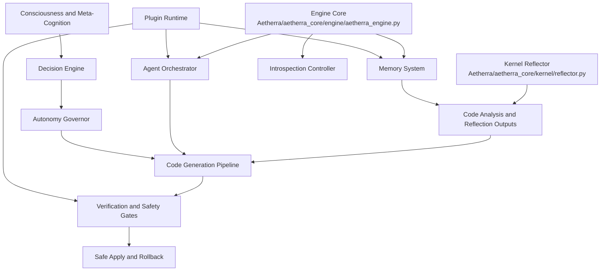

# Dependency Graph (Phase 1.1)

## Scope

This document captures the production-critical dependency graph for the Week 1 foundation pass.
It is grounded in the source-first stub inventory at `docs/STUB_INVENTORY.json` generated on 2026-03-10.

## Baseline Inputs

- Total stubs detected: `410`
- Severity mix: `critical=70`, `high=21`, `medium=70`, `low=249`
- Top hotspot modules:
  - `Aetherra.consciousness.intelligence.meta_cognition` (`23`)
  - `Aetherra.aetherra_core.engine.aetherra_engine` (`17`)
  - `Aetherra.aetherra_core.orchestration.orchestration_bridge` (`17`)
  - `Aetherra.plugins.reflector` (`10`)
  - `Aetherra.aetherra_core.memory.reflector.reflect_analyzer` (`9`)

## Critical Path Graph

## Blocking Relationships

- `kernel.reflector` blocks production reflection outputs, which blocks code generation confidence.
- `engine.aetherra_engine` fallback mocks block deterministic subsystem behavior in production mode.
- `orchestration.orchestration_bridge` stubs block multi-agent orchestration reliability and task handoff.
- `plugins.reflector` and memory reflector adapters block reflection continuity across plugin and core paths.
- `consciousness` hotspot stubs block autonomous decision quality and governance auditability.

## Circular Dependency Risks

Potential cycle candidates to break during Phase 2 implementation:

- `engine -> orchestrator -> plugin executor -> engine`
- `engine -> memory -> reflector -> engine`
- `consciousness -> decision governor -> code generation -> memory feedback -> consciousness`

Mitigation strategy:

- Introduce narrow interfaces at module boundaries.
- Move shared types into neutral contracts modules.
- Enforce one-way dependency rules in CI (import-lint stage).

## Load Order Requirements

Startup order required for deterministic production boot:

1. Config and policy loader (profile, security gates, signing strictness)
2. Memory core and persistence backends
3. Kernel reflector and reflection adapters
4. Engine core (reasoning, introspection, plugin executor)
5. Agent orchestrator and plugin registry
6. Consciousness and autonomy governor loop
7. Hub/API surface and UI bridges

## Week 1.1 Action Priorities

1. Replace `kernel/reflector.py` stubs with AST-backed reflection implementation and tests.
2. Remove fallback mock runtime paths in `aetherra_engine.py` behind explicit optional capability checks.
3. De-stub `orchestration_bridge.py` task lifecycle and dependency execution flow.
4. Add import graph checks for cycle candidates above.
5. Re-run stub inventory and publish delta report after each milestone.
